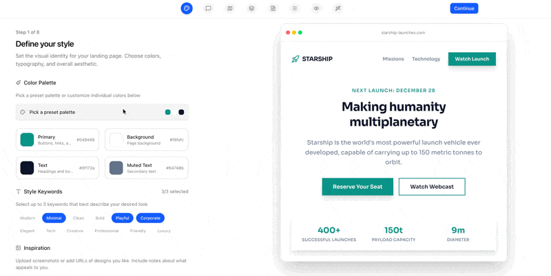

<h1 align="center">Landfall</h1>

<p align="center">
  <strong>Design your landing page spec, then let AI build it.</strong>
</p>

<p align="center">
  <a href="#quick-start">Quick Start</a> &middot;
  <a href="#features">Features</a> &middot;
  <a href="#how-it-works">How It Works</a> &middot;
  <a href="#mcp-integration">MCP Integration</a> &middot;
  <a href="#contributing">Contributing</a>
</p>

---

Landfall is a CLI tool that guides you through a structured wizard to fully spec out a landing page &mdash; style, tone, layout, sections, copy &mdash; then generates a sequence of focused prompts you feed to any AI coding tool. Instead of vague one-shot prompts that produce generic results, you get step-by-step instructions that reference a complete specification.

<p align="center">
  
  <br>
  <em>8-step wizard &rarr; structured spec &rarr; AI-ready prompts</em>
</p>

<p align="center">
  <video src=".github/assets/demo.mp4" width="700" controls></video>
  <br>
  <em>Full demo (45s)</em>
</p>

## Quick Start

```sh
# Initialize Landfall in your project
npx landfall init

# Start the wizard
npx landfall dev

# Open http://localhost:3333 and walk through the 8 steps
```

When you're done designing, click **Build** on the final step. Copy the generated prompts into Claude Code, Cursor, Windsurf, or any AI coding tool &mdash; one prompt at a time &mdash; and watch your landing page come to life.

## Features

**8-step design wizard**
- **Style** &mdash; Pick colors from 42 palettes, choose fonts from Google Fonts, set border radius and shadows, upload visual inspirations
- **Tone** &mdash; Define brand voice, target audience, do's and don'ts, example phrases
- **Sitemap** &mdash; Add and reorder pages with drag-and-drop
- **Sections** &mdash; Choose from 12 section types with 5 layout variants each (60 options total)
- **Copy & Visuals** &mdash; Write per-section copy instructions and attach reference images
- **Navigation** &mdash; Configure navbar style, footer columns, social links, newsletter signup
- **Preview** &mdash; Review wireframes across desktop, tablet, and mobile
- **Build** &mdash; Generate, review, and export the full prompt sequence

**Prompt generation**
- Produces a step-by-step build sequence: style system &rarr; layout &rarr; individual sections
- Each prompt is self-contained with all the context the AI needs
- Output targets Next.js + Tailwind CSS (the stack most AI tools handle best)

**MCP server** (optional)
- Exposes prompts as Model Context Protocol tools
- AI coding tools can pull the next prompt and mark steps complete automatically
- Real-time progress tracking in the Landfall UI

**Everything is local**
- All config stored as JSON files in a `landfall/` directory
- No accounts, no cloud, no telemetry
- Works offline after install

## How It Works

```
1. npx landfall init        Creates landfall/ with template JSON files
2. npx landfall dev         Starts the wizard at localhost:3333
3. Walk through 8 steps     Each change saves to JSON in real time
4. Click Build              Generates prompts in landfall/prompts/
5. Feed to AI coding tool   One prompt at a time, in order
```

The wizard writes everything to plain JSON files:

```
landfall/
├── config.json             # Project metadata
├── style.json              # Colors, fonts, keywords, shadows
├── tone.json               # Voice, audience, guidelines
├── sitemap.json            # Pages and structure
├── navigation.json         # Navbar and footer config
├── pages/
│   ├── home.json           # Sections for each page
│   └── ...
├── assets/                 # Uploaded inspiration images
└── prompts/
    └── build-sequence.json # Generated prompt sequence
```

You can edit these files directly or use the web UI &mdash; changes sync both ways.

## MCP Integration

Landfall ships with an MCP server so AI tools can orchestrate the build automatically instead of manual copy-paste.

Add it to your `.mcp.json` or tool config:

```json
{
  "mcpServers": {
    "landfall": {
      "command": "npx",
      "args": ["landfall-mcp"],
      "env": {
        "LANDFALL_PROJECT_PATH": "./landfall"
      }
    }
  }
}
```

The MCP server exposes:
- `landfall_get_project_info` &mdash; Project overview
- `landfall_get_next_step` &mdash; Next prompt to execute
- `landfall_mark_step_complete` &mdash; Mark a step done
- `landfall_get_status` &mdash; Build progress

Then tell your AI tool: *"Build my Landfall project"* and it handles the rest.

## CLI Reference

| Command | Description |
|---------|-------------|
| `landfall init` | Scaffold the `landfall/` directory with template configs |
| `landfall dev [--port 3333]` | Start the wizard web app |
| `landfall build` | Generate prompts without the UI |

## Tech Stack

- **CLI**: Node.js, Commander.js, TypeScript
- **Web app**: Next.js 16, React 19, Tailwind CSS 4, Radix UI
- **MCP**: `@modelcontextprotocol/sdk`
- **Generated output**: targets Next.js + Tailwind CSS

## Development

```sh
git clone https://github.com/AmElmo/landfall.git
cd landfall
npm install
npm run dev
```

The app runs at `http://localhost:3000` in development mode.

To build the CLI separately:

```sh
npm run build:cli
```

## Contributing

Contributions welcome! Feel free to open issues or submit pull requests.

If you're thinking about a larger change, open an issue first so we can discuss the approach.

## License

MIT
